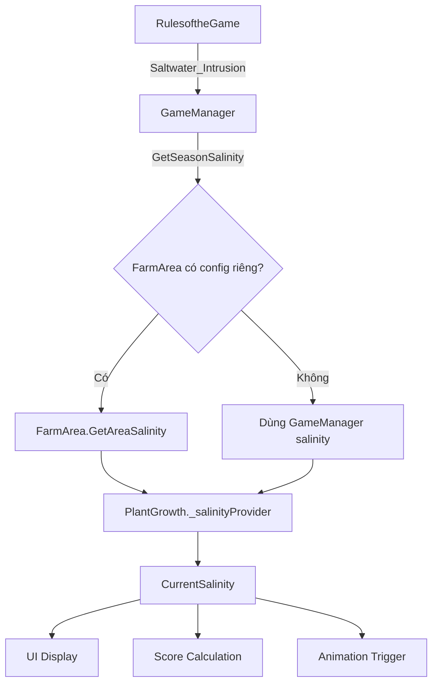

# Hệ thống Độ mặn (Salinity System)

## Tổng quan

Độ mặn (Salinity) là yếu tố môi trường quan trọng ảnh hưởng đến điểm số thu hoạch trong game. Hệ thống này mô phỏng:
- **Mùa mưa**: Độ mặn thấp (0.30‰)
- **Mùa khô**: Độ mặn cao (0.75‰ hoặc cao hơn)

---

## Sơ đồ cấu trúc

```
┌─────────────────────────────────────────────────────────────────────┐
│                  RulesoftheGame_VU2_1.cs                            │
│  ┌───────────────────────────────────────────────────────────────┐  │
│  │  static Saltwater_Intrusion = 0f (Rainy) or 1f (Dry)          │  │
│  │  - 0~90s:  Rainy1 → Saltwater_Intrusion = 0                   │  │
│  │  - 90~180s: Dry   → Saltwater_Intrusion = 1                   │  │
│  └───────────────────────────────────────────────────────────────┘  │
└───────────────────────┬─────────────────────────────────────────────┘
                        │ Được dùng bởi
                        ▼
┌─────────────────────────────────────────────────────────────────────┐
│                  Thuan_23127_GameManager.cs                         │
│  ┌───────────────────────────────────────────────────────────────┐  │
│  │  GetSeasonSalinity() - CÔNG THỨC CHÍNH                        │  │
│  │  ─────────────────────────────────────────────────────────────│  │
│  │  salinityBase = 0.3f;   // Độ mặn cơ sở                       │  │
│  │  rainyFactor  = 1.0f;   // Hệ số mùa mưa                      │  │
│  │  dryFactor    = 2.5f;   // Hệ số mùa khô                      │  │
│  │                                                                │  │
│  │  FORMULA:                                                      │  │
│  │  factor = Lerp(rainyFactor, dryFactor, Saltwater_Intrusion)   │  │
│  │  return salinityBase × factor                                 │  │
│  │                                                                │  │
│  │  Mùa Mưa: 0.3 × 1.0 = 0.30‰                                   │  │
│  │  Mùa Khô: 0.3 × 2.5 = 0.75‰                                   │  │
│  └───────────────────────────────────────────────────────────────┘  │
└───────────────────────┬─────────────────────────────────────────────┘
                        │ Fallback nếu FarmArea không có config riêng
                        ▼
┌─────────────────────────────────────────────────────────────────────┐
│                        FarmArea.cs                                  │
│  ┌───────────────────────────────────────────────────────────────┐  │
│  │  useAreaSeasonalSalinity = true → Dùng độ mặn riêng của vùng  │  │
│  │                                                                │  │
│  │  rainySalinity = 0.5f;  // Độ mặn mùa mưa cho vùng này        │  │
│  │  drySalinity   = 2.0f;  // Độ mặn mùa khô cho vùng này        │  │
│  │                                                                │  │
│  │  GetAreaSalinity():                                           │  │
│  │  ─────────────────────────────────────────────────────────────│  │
│  │  if (useAreaSeasonalSalinity)                                 │  │
│  │    → isRainy ? rainySalinity : drySalinity                    │  │
│  │  else                                                          │  │
│  │    → GameManager.GetSeasonSalinity() (fallback)               │  │
│  └───────────────────────────────────────────────────────────────┘  │
└───────────────────────┬─────────────────────────────────────────────┘
                        │ Được inject vào PlantGrowth
                        ▼
┌─────────────────────────────────────────────────────────────────────┐
│                  Thuan_23127_PlantGrowth.cs                         │
│  ┌───────────────────────────────────────────────────────────────┐  │
│  │  _salinityProvider ← FarmArea.GetAreaSalinity                 │  │
│  │                                                                │  │
│  │  CurrentSalinity():                                           │  │
│  │  → if (_salinityProvider != null) return _salinityProvider()  │  │
│  │  → else return GameManager.GetSeasonSalinity()                │  │
│  │                                                                │  │
│  │  DÙNG ĐỂ:                                                      │  │
│  │  1. Hiển thị trên UI                                          │  │
│  │  2. So sánh với salinity_threshold                            │  │
│  │  3. Tính điểm (AdjustBySalinity)                              │  │
│  │  4. Trigger animation xấu nếu vượt ngưỡng > 10s               │  │
│  └───────────────────────────────────────────────────────────────┘  │
└─────────────────────────────────────────────────────────────────────┘
```

---

## Công thức tính điểm theo độ mặn

### Trong `PlantGrowth.AdjustBySalinity()`:

```csharp
if (salinity <= threshold)
    return baseScore;           // Điểm đầy đủ
else
    return baseScore × (threshold / salinity);  // Giảm tỷ lệ
```

### Ví dụ:
- **Sầu riêng**: ngưỡng chịu mặn = 0.8‰
- **Độ mặn hiện tại** = 1.6‰
- **Điểm** = 100 × (0.8 / 1.6) = **50 điểm**

---

## Bảng ngưỡng độ mặn theo loại cây

| Loại | ID | Ngưỡng (‰) | Ghi chú |
|------|-----|------------|---------|
| Sầu riêng | 1 | 0.8 | Rất nhạy cảm với mặn |
| Dừa | 10 | 1.2 | Chịu mặn tốt hơn |
| Lúa | 11 | 0.4 | Cần nước ngọt |
| Cá điêu hồng | 2 | - | Chỉ sống trong nước ngọt |
| Tôm sú | 5 | - | Chỉ sống trong nước lợ/mặn |

---

## Danh sách files liên quan

| File | Vai trò |
|------|---------|
| `RulesoftheGame_VU2_1.cs` | Định nghĩa `Saltwater_Intrusion` (0=mưa, 1=khô) |
| `Thuan_23127_GameManager.cs` | Công thức `GetSeasonSalinity()` toàn cục |
| `FarmArea.cs` | Độ mặn riêng cho từng vùng (`GetAreaSalinity()`) |
| `Thuan_23127_PlantGrowth.cs` | Dùng độ mặn để tính điểm và animation |
| `David_SeasonHUD.cs` | Hiển thị độ mặn Trong Đê / Ngoài Đê |
| `Thuan_23127_AreaHUD.cs` | Hiển thị độ mặn trên bảng thông tin cây |

---

## Biểu đồ luồng dữ liệu



---

*Tài liệu được tạo tự động từ phân tích code project VU2.*
