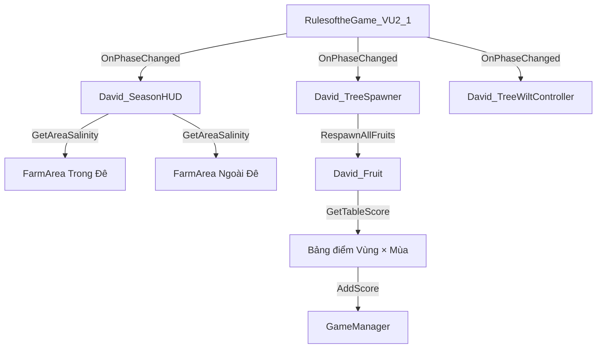

# 📚 DavidNguyen Scripts

## 📋 Tổng quan

Package quản lý **cây trái**, **trứng**, **hiệu ứng héo** và **HUD độ mặn** trong SIMPLE VU2.

### Danh sách File

| File | Trạng thái | Mô tả |
|------|------------|-------|
| `David_SeasonHUD.cs` | ✅ Đang dùng | HUD mực nước + độ mặn Trong/Ngoài Đê |
| `David_TreeSpawner.cs` | ✅ Đang dùng | Quản lý trái cây (pre-placed/spawn) |
| `David_Fruit.cs` | ✅ Đang dùng | Thu hoạch + **tính điểm theo bảng** |
| `David_TreeWiltController.cs` | ✅ Đang dùng | Hiệu ứng héo cây mùa khô |
| `David_Egg.cs` | ⚠️ Tùy chọn | Tag cho trứng gà |

---

## 🔄 Luồng hoạt động



---

## 📁 Chi tiết từng File

### 1. David_SeasonHUD.cs

Hiển thị HUD mực nước + độ mặn 2 vùng với animation mượt.


| Trường | Mô tả |
|--------|-------|
| `insideDykeArea` | FarmArea vùng **Trong Đê** |
| `outsideDykeArea` | FarmArea vùng **Ngoài Đê** |
| `maxSalinity` | Độ mặn max cho Slider (mặc định 5‰) |
| `transitionDuration` | Thời gian animation (10s) |

---

### 2. David_TreeSpawner.cs

Quản lý trái cây trên cây - 2 chế độ:

| Chế độ | `usePrePlacedFruits` | Mô tả |
|--------|---------------------|-------|
| Pre-placed | `true` ✅ | Reset vị trí trái khi đổi mùa |
| Spawn | `false` | Spawn từ prefab |

**Cách dùng:** Gắn vào cây → Đặt trái làm con → Thêm `David_Fruit` → Bật `usePrePlacedFruits`

---

### 3. David_Fruit.cs ⭐

Thu hoạch trái cây với **điểm tính theo bảng Vùng × Mùa**.

| Trường | Mô tả |
|--------|-------|
| `fruitType` | Loại: Coconut / Durian / Fish |
| `ownerArea` | FarmArea để xác định Ngọt/Lợ (tự tìm nếu trống) |
| `destroyOnCollect` | true = Xóa, false = Ẩn (để respawn) |

**Bảng điểm tự động:**

| Loại | Ngọt + Mưa | Ngọt + Khô | Lợ + Mưa | Lợ + Khô |
|------|------------|------------|----------|----------|
| **Sầu riêng** | 15 | 10 | 6 | 4 |
| **Dừa** | 12 | 8 | 8 | 5 |
| **Cá** | 1 | 2 | 3 | 4 |

> **Lưu ý:** Sầu riêng chỉ hái được **mùa mưa** (độ mặn thấp)

---

### 4. David_TreeWiltController.cs

Hiệu ứng héo cây theo mùa:

```
Mùa mưa → Khỏe mạnh (xanh, scale lớn)
Mùa khô → Héo úa (nâu, scale nhỏ)
```

---

### 5. David_Egg.cs

Tag component cho trứng. Logic spawn nằm trong `Thuan_23127_ChickenEggSpawner.cs`.

---

## 🔗 Liên kết Package

| Package | File | Chức năng |
|---------|------|-----------|
| Thuan_23127 | `PlantGrowth.cs` | Tính điểm cây/vật nuôi trong FarmArea |
| Thuan_23127 | `ChickenEggSpawner.cs` | Spawn trứng + reset mùa |
| Thuan_23127 | `GameManager.cs` | Quản lý điểm số |
| Managers | `RulesoftheGame_VU2_1.cs` | Điều khiển mùa + event |

---

## ✅ Checklist Setup

- [ ] `David_SeasonHUD`: Kéo 2 FarmArea vào `insideDykeArea` + `outsideDykeArea`
- [ ] `David_TreeSpawner`: Gắn vào cây, bật `usePrePlacedFruits = true`
- [ ] `David_Fruit`: Gắn vào từng trái, chọn đúng `fruitType`
- [ ] `David_TreeWiltController`: Gắn vào cây cần hiệu ứng héo
